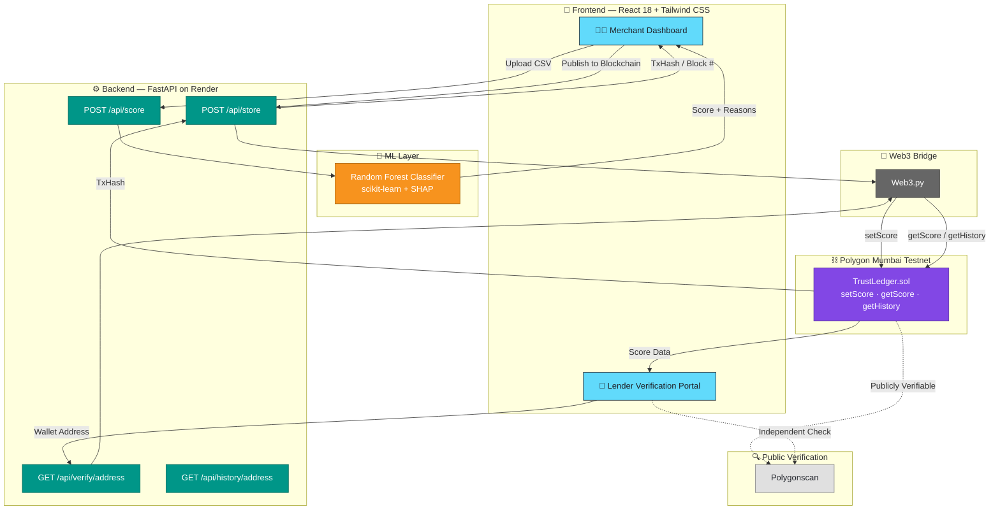
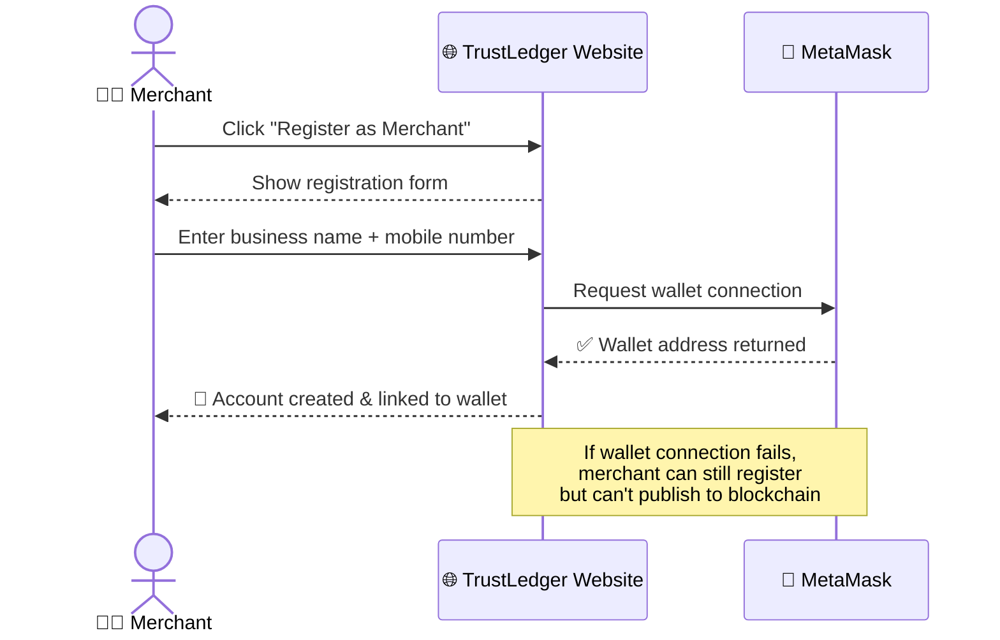
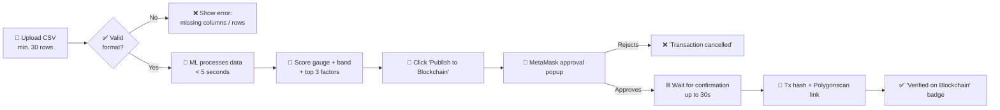
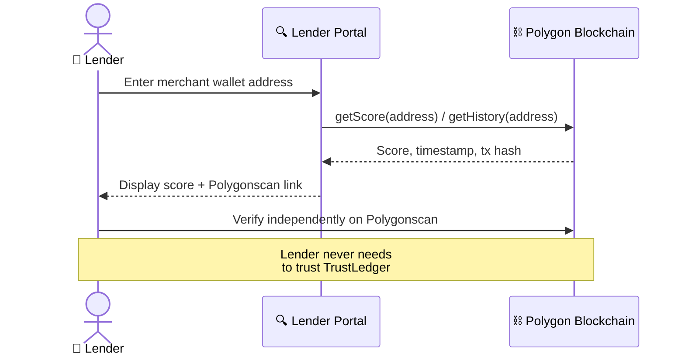
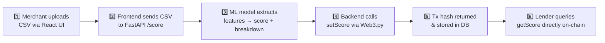
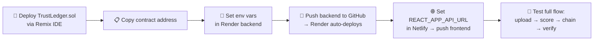

<div align="center">

# 🔗 TrustLedger

### *AI-Powered Credit Scoring with Blockchain Verification for Indian SMBs*

**Turning UPI transaction history into a tamper-proof, bank-verifiable credit score — no trust in a middleman required.**

[](#)
[](#)
[](#)
[](#)
[](#)
[](#)

<br>

🇮🇳 **Team TrustLedger** &nbsp;|&nbsp; 📍 Agent{A}thon 2026 &nbsp;|&nbsp; 🗓️ June 2026

</div>

---

## 📖 Table of Contents

- [🎯 About the Project](#-about-the-project)
- [✨ Key Features](#-key-features)
- [🏗️ System Architecture](#️-system-architecture)
- [🔄 User Flows](#-user-flows)
- [🛠️ Tech Stack](#️-tech-stack)
- [📜 Smart Contract Spec](#-smart-contract-spec)
- [🧠 ML Model Spec](#-ml-model-spec)
- [🔌 API Reference](#-api-reference)
- [📏 Business Rules](#-business-rules)
- [🎨 UI / UX & Accessibility](#-ui--ux--accessibility)
- [✅ Acceptance Criteria](#-acceptance-criteria)
- [☁️ Deployment](#️-deployment)
- [🔐 Security & Privacy](#-security--privacy)
- [⚠️ Risks & Mitigations](#️-risks--mitigations)
- [🚀 Getting Started](#-getting-started)
- [🗺️ Assumptions & Constraints](#️-assumptions--constraints)
- [📚 Glossary](#-glossary)

---

## 🎯 About the Project

> India has **~63 million SMBs**, most operating informally on UPI rails like Paytm. Despite having rich, verifiable payment histories, they're **invisible to banks and NBFCs** — no CIBIL score, no trusted way to prove revenue, no path to formal credit.

**TrustLedger** closes that gap: merchants upload their Paytm transaction history, an ML model generates a **0–100 credit score with explainable factors**, and the score is published **immutably on the Polygon blockchain** — so any lender can verify it independently, without ever trusting TrustLedger itself.

| 🧾 For Merchants | 🏦 For Lenders | ⛓️ For Everyone |
|:---:|:---:|:---:|
| Turn UPI history into a shareable credit score | Verify scores directly on-chain, no login needed | Zero-trust verification via Polygonscan |

<details>
<summary><b>📌 Glossary</b> (click to expand)</summary>
<br>

| Term | Meaning |
|---|---|
| **Credit Score** | Numerical value (0–100) representing creditworthiness from transaction behaviour |
| **Blockchain** | Distributed, tamper-proof ledger — Polygon stores merchant scores here |
| **MetaMask** | Browser wallet extension for Ethereum-compatible blockchains |
| **Polygon Mumbai** | Test blockchain network — no real money involved |
| **Polygonscan** | Public blockchain explorer to verify Polygon transactions |
| **Transaction Hash** | Unique ID proving data was written to the blockchain |
| **NBFC** | Non-Banking Financial Company — a non-bank lender |
| **DPDP Act 2023** | India's Digital Personal Data Protection Act |
| **CSV** | Comma-Separated Values — the transaction upload format |

</details>

---

## ✨ Key Features

<table>
<tr>
<td width="50%" valign="top">

### 🔐 Merchant Registration
- 🏪 Register with business name + mobile number
- 🦊 MetaMask wallet connection = blockchain identity
- 📲 OTP-based mobile authentication
- ⏳ 24-hour login session
- 🚪 Log out from all devices

### 📤 Transaction Data Upload
- 📁 CSV upload, up to 10MB
- ✅ Column & row-count validation (min. 30 rows)
- 📋 Downloadable CSV template
- 📊 Upload progress indicator for files > 1MB

### 🎯 Credit Score Generation
- 🔵 Score from 0–100, generated in **< 5 seconds**
- 🎨 Animated circular gauge with colour bands
- 🏷️ Band label: Poor / Fair / Good / Excellent
- 🔍 Top 3 contributing factors (positive/negative)
- 📈 Comparison to average merchant score

</td>
<td width="50%" valign="top">

### ⛓️ Blockchain Publishing
- 🚀 One-click publish to Polygon Mumbai
- 🦊 MetaMask approval popup for gas-fee transaction
- ⏱️ Confirmation within 30 seconds
- 🔗 Transaction hash + direct Polygonscan link
- ✅ "Verified on Blockchain" badge
- 🕓 Full score history retained

### 🏦 Lender Verification Portal
- 🔎 Look up any score by merchant wallet address
- 📄 Score, timestamp & blockchain proof shown
- 🚫 No login or account creation required
- 🔒 Fully read-only — zero write access
- 🌐 Independent verification via Polygonscan

### 📜 Score Certificate
- 🖨️ Downloadable PDF certificate
- 🧾 Includes score, date, merchant name, tx hash
- 📱 QR code linking to Polygonscan proof

</td>
</tr>
</table>

---

## 🏗️ System Architecture



### 🧬 4-Layer Design

| Layer | Description |
|---|---|
| 1️⃣ **Data & AI** | Python ML pipeline ingests transaction CSV → generates credit score (0–100) |
| 2️⃣ **Backend API** | FastAPI bridges ML model and blockchain, exposes REST endpoints |
| 3️⃣ **Blockchain** | Solidity smart contract on Polygon Mumbai stores immutable score records |
| 4️⃣ **Frontend** | React dashboard for merchants + a separate read-only lender portal |

---

## 🔄 User Flows

<details open>
<summary><b>1️⃣ Merchant Registration (UC-01)</b></summary>



</details>

<details>
<summary><b>2️⃣ Upload → Score → Publish Flow (UC-02 → UC-04)</b></summary>



</details>

<details>
<summary><b>3️⃣ Lender Verification Flow (UC-06)</b></summary>



</details>

---

## 🛠️ Tech Stack

<div align="center">

### Frontend


### Backend & AI


### Blockchain


### Deployment


</div>

| Component | Technology & Justification |
|---|---|
| 🧠 ML Model | Python 3.10 + scikit-learn (Random Forest) — lightweight, interpretable |
| ⚙️ Backend | FastAPI (Python) — async REST API, auto-generated Swagger docs |
| ⛓️ Blockchain | Solidity 0.8.x on Polygon Mumbai — low gas fees, EVM-compatible |
| 🌉 Web3 Bridge | Web3.py — interacts with the smart contract from the backend |
| 🎨 Frontend | React 18 + Tailwind CSS — fast, component-based UI |
| 🗄️ Data Storage | Local CSV (hackathon) → PostgreSQL (production) |
| ☁️ Deployment | Netlify (frontend) + Render (backend) + Polygon Mumbai (contract) |

### 🔄 Data Flow



---

## 📜 Smart Contract Spec

**Contract:** `TrustLedger.sol` &nbsp;|&nbsp; **Network:** Polygon Mumbai Testnet (Chain ID `80001`) &nbsp;|&nbsp; **Compiler:** Solidity `^0.8.0` &nbsp;|&nbsp; **License:** MIT

### 🗃️ State Variables

| Variable | Description |
|---|---|
| `mapping(address ⇒ uint256) creditScore` | Maps merchant wallet to their latest credit score |
| `mapping(address ⇒ uint256) lastUpdated` | Timestamp of last score update per merchant |
| `mapping(address ⇒ uint256[]) scoreHistory` | Historical score array per merchant |
| `address public owner` | Contract deployer address (admin-only functions) |

### ⚙️ Functions

| Function | Description |
|---|---|
| `setScore(address merchant, uint256 score)` | Write/update credit score for a merchant. Emits `ScoreUpdated` |
| `getScore(address merchant) returns (uint256)` | Read current score — public view function |
| `getHistory(address merchant) returns (uint256[])` | Return full score history array |
| `getLastUpdated(address merchant) returns (uint256)` | Return Unix timestamp of last update |

### 📢 Events

```solidity
event ScoreUpdated(address indexed merchant, uint256 score, uint256 timestamp);
```

---

## 🧠 ML Model Spec

### 📥 Input Features

| Feature | Description & Derivation |
|---|---|
| `avg_txn_value` | Mean transaction amount over dataset period |
| `txn_frequency` | Transactions per day (total txns / days) |
| `peak_hour_ratio` | % of transactions in the 9am–9pm window |
| `refund_rate` | Refunds ÷ total transactions |
| `growth_rate` | % change in monthly revenue (MoM) |
| `consistency_score` | Std. deviation of weekly revenue (lower = more consistent) |
| `unique_customers` | Count of unique payer IDs (customer-base proxy) |

### 🧪 Model Details

| Attribute | Value |
|---|---|
| 🌳 Algorithm | Random Forest Classifier (scikit-learn) |
| 📊 Training Data | Synthetic dataset — 5,000 merchant profiles (creditworthy / not) |
| 🎯 Output | Probability score, scaled to 0–100 |
| 🔍 Explainability | SHAP values → top 3 contributing features per prediction |
| ✅ Validation | 80/20 train-test split; target accuracy **> 85%** |

---

## 🔌 API Reference

**Base URL:** `https://trustledger-api.onrender.com/api/v1`

| Endpoint | Method | Request | Response |
|---|:---:|---|---|
| `/score` | `POST` | CSV file (`multipart/form-data`) | `{ score, reasons[], merchant_id }` |
| `/store` | `POST` | `{ merchant_address, score }` | `{ tx_hash, block_number }` |
| `/verify/{address}` | `GET` | Wallet address in path | `{ score, timestamp, tx_hash }` |
| `/history/{address}` | `GET` | Wallet address in path | `{ scores[], timestamps[] }` |
| `/health` | `GET` | — | `{ status: 'ok', version: '1.0' }` |

<details>
<summary><b>📋 Full Functional Requirement IDs</b> (click to expand)</summary>
<br>

| Category | Requirements |
|---|---|
| 🧠 ML Scoring Engine | `FR-ML-01` → `FR-ML-05`: CSV ingestion, 6-feature extraction, 0–100 score, top-3 explainability, < 5s inference for ≤10K rows |
| ⛓️ Blockchain Integration | `FR-BC-01` → `FR-BC-05`: address→score mapping, block timestamps, public retrievability, audit events, Mumbai testnet deploy |
| ⚙️ Backend API | `FR-API-01` → `FR-API-05`: `/score`, `/store`, `/verify`, `/history` endpoints, consistent JSON + status codes |
| 🧑‍💼 Merchant Frontend | `FR-FE-01` → `FR-FE-04`: CSV upload, gauge visualization, 3-factor breakdown, Polygonscan proof button |
| 🏦 Lender Frontend | `FR-LP-01` → `FR-LP-03`: address search, score/timestamp/proof display, strictly read-only |

</details>

---

## 📏 Business Rules

### 🎨 Credit Score Bands

| Score Range | Band & Colour | Meaning |
|:---:|:---:|---|
| 81 – 100 | 🟢 **Excellent** | Highly creditworthy — recommended for loan approval |
| 61 – 80 | 🔵 **Good** | Creditworthy — eligible for standard loan products |
| 41 – 60 | 🟡 **Fair** | Moderate risk — eligible for micro-loans with conditions |
| 0 – 40 | 🔴 **Poor** | High risk — further review recommended before lending |

### ⚖️ Score Factor Rules

| Factor | Effect |
|---|---|
| 💰 Average Daily Revenue | Higher average → ➕ positive |
| 🔁 Transaction Frequency | More transactions/day → more stable → ➕ positive |
| ↩️ Refund Rate | > 5% of transactions → ➖ negative |
| 📈 Growth Rate | Positive MoM revenue growth → ➕ positive |
| 🕒 Business Hours Consistency | Regular spread of transaction hours → ➕ positive |
| 👥 Customer Base Size | More unique customers → lower dependency risk → ➕ positive |

### 🔒 Data Privacy Rules

- 🧠 Transaction data is processed **in memory only** — not permanently stored after scoring
- ⛓️ Only the **numeric score + timestamp** go on-chain — no transaction details
- 🔑 Merchant **wallet address** is the sole on-chain identifier
- 📜 Compliant with India's **DPDP Act 2023** data-handling guidelines

---

## 🎨 UI / UX & Accessibility

<table>
<tr>
<td width="50%" valign="top">

### 🧑‍💼 Merchant Dashboard
- 🎯 Score gauge shown prominently, above the fold
- 🎬 Gauge animates 0 → actual score on first load
- ✅❌ Colour-coded icons for factor breakdown
- 🌐 Full English + Hindi text support
- 📱 Responsive down to 360px width

</td>
<td width="50%" valign="top">

### 🏦 Lender Portal
- 🔎 Single, uncluttered search bar
- ⏱️ Results appear within 10 seconds
- 🔗 Polygonscan link opens in new tab
- ❓ "How to verify independently" help text visible

</td>
</tr>
</table>

### ♿ Accessibility

- ⌨️ Keyboard focus states on all interactive elements
- 🎨 Colour-blind-safe palette — labels accompany all colour bands
- 🗣️ Screen-reader-accessible ARIA labels on the score gauge

---

## ✅ Acceptance Criteria

<details>
<summary><b>🎯 Score Generation</b></summary>
<br>

1. **Given** a valid CSV with 50+ rows, **when** the user clicks "Generate Score," **then** a score between 0–100 displays within 5 seconds.
2. **Given** a CSV with fewer than 30 rows, **when** submitted, **then** error *"Minimum 30 transactions required"* is shown.
3. **Given** a score has been generated, **when** viewing the dashboard, **then** exactly 3 factors display with positive/negative indicators.

</details>

<details>
<summary><b>⛓️ Blockchain Publishing</b></summary>
<br>

1. **Given** a connected wallet and generated score, **when** "Publish to Blockchain" is clicked, **then** a MetaMask approval popup appears.
2. **Given** the transaction is approved, **when** confirmed, **then** a valid Polygon tx hash displays within 30 seconds.
3. **Given** a tx hash is shown, **when** the Polygonscan link is clicked, **then** the on-chain record shows the correct score.

</details>

<details>
<summary><b>🏦 Lender Verification</b></summary>
<br>

1. **Given** a valid merchant wallet address, **when** "Verify" is clicked, **then** score, publication date, and tx hash display.
2. **Given** an invalid/unregistered address, **when** "Verify" is clicked, **then** *"No score found for this address"* is shown.
3. **Given** a verification result is displayed, **then** a visible Polygonscan link is included for independent verification.

</details>

---

## ☁️ Deployment



| Component | Platform |
|---|---|
| 🎨 Frontend | Netlify (free tier, GitHub-connected) |
| ⚙️ Backend | Render.com (free tier, FastAPI Docker container) |
| ⛓️ Smart Contract | Remix IDE → Polygon Mumbai Testnet |
| 🪙 Test MATIC | [faucet.polygon.technology](https://faucet.polygon.technology) |

<details>
<summary><b>🔑 Environment Variables</b> (click to expand)</summary>
<br>

| Variable | Description |
|---|---|
| `PRIVATE_KEY` | Deployer wallet private key — **never commit to GitHub** |
| `POLYGON_RPC_URL` | Polygon Mumbai RPC endpoint |
| `CONTRACT_ADDRESS` | Deployed TrustLedger contract address |
| `REACT_APP_API_URL` | Backend API base URL |

</details>

---

## 🔐 Security & Privacy

- 🚫 No private keys in code — environment variables only (`NFR-04`)
- 🔁 Blockchain write failures retried up to **3 times**
- 🐳 Backend containerizable via Docker for portable deployment
- 🌐 CORS restricted to the Netlify frontend domain
- 🧠 Transaction data never persisted post-scoring — DPDP Act 2023 aligned

| NFR | Specification |
|---|---|
| ⚡ Performance | API < 5s for scoring; < 30s for blockchain write |
| 🟢 Availability | 99% uptime for hackathon demo duration |
| 📈 Scalability | Backend handles 50 concurrent API requests |
| 📱 Usability | Works on desktop **and** mobile browsers |

---

## ⚠️ Risks & Mitigations

| Risk | Mitigation |
|---|---|
| 🐢 Polygon testnet congestion / slow tx | Pre-deploy contract before demo; keep backup tx hash ready |
| 🚫 No real Paytm API access | Use synthetic CSV mirroring real Paytm export format |
| 📉 ML model low accuracy on synthetic data | Rule-based fallback scoring if accuracy < 70% |
| 🌐 Frontend–API CORS errors | FastAPI CORS middleware allow-lists the Netlify domain |
| 🧑‍💻 Team unfamiliar with Solidity | Use Remix IDE — no local setup, contract is < 50 lines |

---

## 🚀 Getting Started

```bash
# 1️⃣ Clone the repository
git clone https://github.com/<your-org>/trustledger.git
cd trustledger

# 2️⃣ Backend setup
cd backend
python -m venv venv && source venv/bin/activate
pip install -r requirements.txt
cp .env.example .env   # add PRIVATE_KEY, POLYGON_RPC_URL, CONTRACT_ADDRESS
uvicorn main:app --reload

# 3️⃣ Smart contract deployment
# Open TrustLedger.sol in https://remix.ethereum.org
# Compile → Deploy to "Injected Provider - MetaMask" on Polygon Mumbai
# Copy the deployed contract address into backend .env

# 4️⃣ Frontend setup
cd ../frontend
npm install
cp .env.example .env   # set REACT_APP_API_URL
npm run dev
```

> 💡 **Tip:** Get free test MATIC from the [Polygon faucet](https://faucet.polygon.technology) before publishing scores — real funds are never required.

---

## 🗺️ Assumptions & Constraints

<table>
<tr>
<td width="50%" valign="top">

### 🤔 Assumptions
- CSV follows Paytm statement format or provided template
- Merchants have a MetaMask browser wallet
- Judges have MetaMask access for the demo
- Polygon Mumbai testnet is operational during the demo
- Synthetic data used — no live Paytm API access

</td>
<td width="50%" valign="top">

### 🚧 Constraints
- Must be deployable within a **4-hour** hackathon window
- **No real money** — Mumbai testnet only
- No Paytm production API — synthetic data only
- Chrome browser minimum — no IE/Safari requirement

</td>
</tr>
</table>

---

## 📚 Glossary

| Term | Definition |
|---|---|
| **Credit Score** | Numerical value (0–100) representing creditworthiness from transaction behaviour |
| **Blockchain** | Distributed, tamper-proof ledger storing merchant scores |
| **MetaMask** | Browser wallet extension for Ethereum-compatible blockchains |
| **Polygon Mumbai** | Test blockchain network — no real money involved |
| **Polygonscan** | Public explorer for verifying Polygon transactions |
| **Transaction Hash (TxID)** | Unique ID proving data was stored on-chain |
| **NBFC** | Non-Banking Financial Company |
| **DPDP Act 2023** | India's Digital Personal Data Protection Act |
| **CSV** | Comma-Separated Values — transaction upload format |
| **SHAP** | Explainability method used to derive top score-driving factors |

---

<div align="center">

### 🌟 Non-Functional Highlights

| ⚡ Speed | 🟢 Reliability | 📲 Mobile | 🔌 Offline Handling |
|:---:|:---:|:---:|:---:|
| Score < 5s, chain write < 30s | Retries on-chain writes up to 3x | Full support on Chrome mobile | Local score shown + publish queued |

<br>

Built for **Agent{A}thon 2026 — Track 3: Paytm Challenge** 🇮🇳

</div>
